# Energy Optimization in Tai Lung Veterinary Laboratory: Predictive Modelling for Chiller Equipment Efficiency


This project enhances building energy management through predictive modelling of air-cooled chiller efficiency at the **Tai Lung Veterinary Laboratory** in Hong Kong. Machine learning models predict the **Coefficient of Performance (COP)** and **cooling load** based on environmental and temporal inputs, enabling optimised chiller operation strategies that reduce energy consumption and carbon emissions.

**Key Result:** The simulation reveals a potential energy savings of **20.95%**, highlighting the impact of predictive analytics in building energy management.

**Award:** This project was awarded the **EDPS Innovative Scholarship Award 2024–25** (HK$20,000).

---

## Table of Contents

- [Features](#features)
- [Dashboard Pages](#dashboard-pages)
- [Repository Structure](#repository-structure)
- [Data](#data)
- [Models](#models)
- [Getting Started](#getting-started)
- [Usage](#usage)
- [Known Issues](#known-issues)
- [References](#references)
- [Author](#author)
- [Links](#links)
- [License](#license)

---

## Features

- **COP Prediction** — Individual CatBoost models for each of the three air-cooled chillers to predict their Coefficient of Performance
- **Cooling Load Prediction** — A CatBoost model to forecast total cooling load demand based on weather conditions and time features
- **Real-Time Weather Integration** — Fetches live temperature and humidity data from the [OpenWeatherMap API](https://openweathermap.org/api) for the Tai Lung area
- **4-Day Forecast Prediction** — Generates chiller operation recommendations using hourly weather forecasts
- **Simulation Engine** — Compares actual vs. optimised power consumption across the full data period or custom months
- **Interactive Dashboard** — Streamlit-based dashboard with data exploration, prediction, and simulation pages

---

## Dashboard Pages

### Explore 🔎
- Browse raw operational data for each chiller
- Visualise chiller operation timelines (July 2022 – March 2024)
- View strategy breakdowns (one-chiller, two-chiller, three-chiller usage)
- Correlation heatmaps across key features (COP, power supply, cooling output, water flow, temperature, humidity)
- Seasonal trends for cooling load, power usage, and COP by hour and month
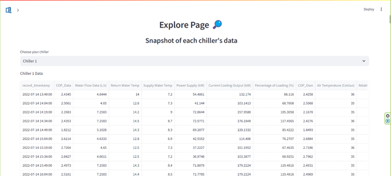
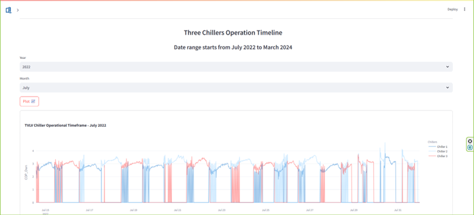
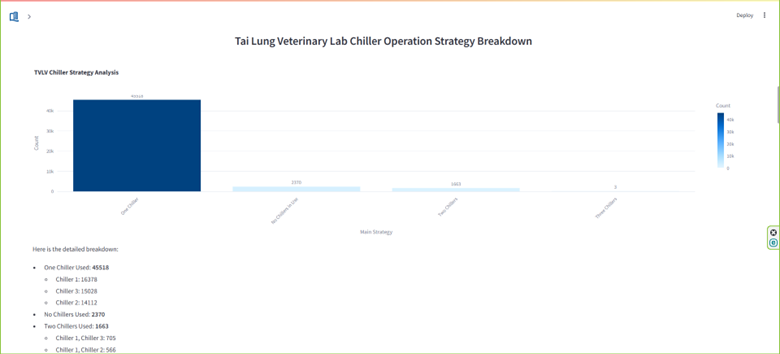
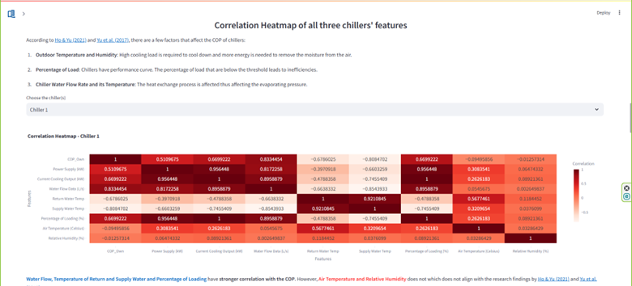
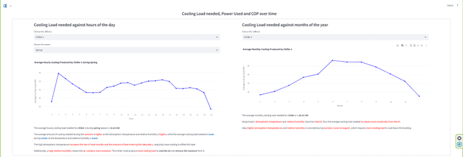
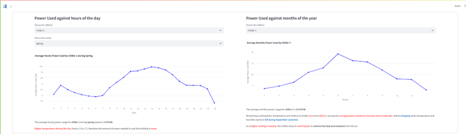
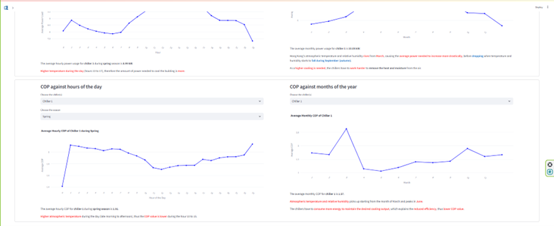

### Predict 🔮
- Input weather data manually, use real-time API data, or load a 4-day hourly forecast
- Predict cooling load and optimal chiller operation strategy
- View predicted COP and power breakdown per chiller
- Strategy summary showing most/least used and most/least cost-saving strategies
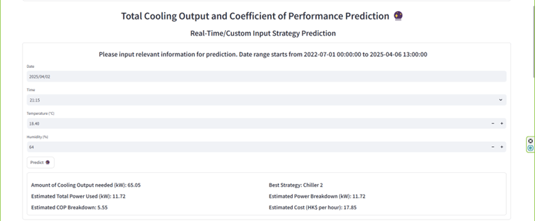
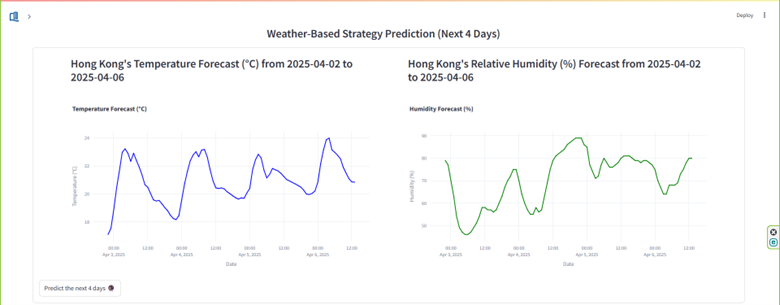
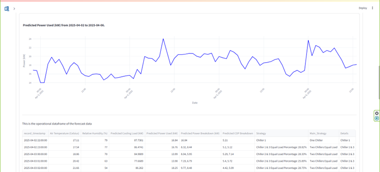
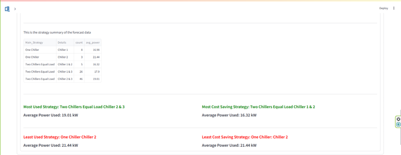
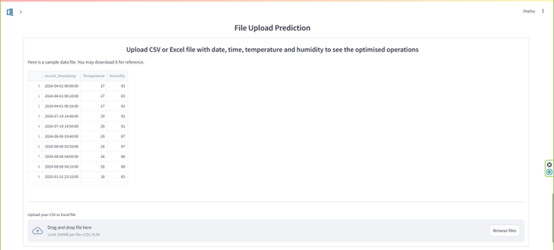
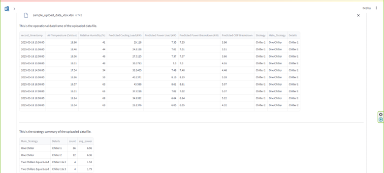
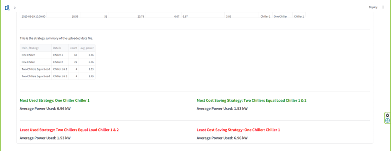

### Simulation 🕹️
- Simulate optimised chiller operation for the whole period or a selected month
- Compare actual vs. predicted power consumption with interactive line charts
- View power savings (kW), percentage savings, and estimated cost savings (HKD)
- Strategy summary with detailed breakdowns
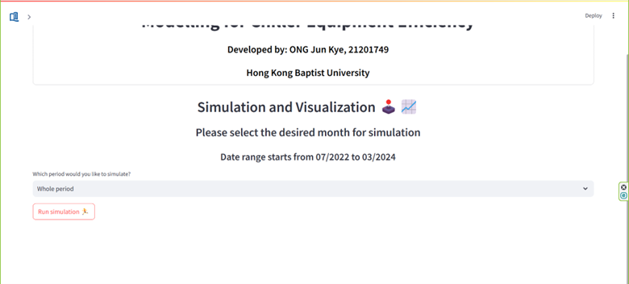
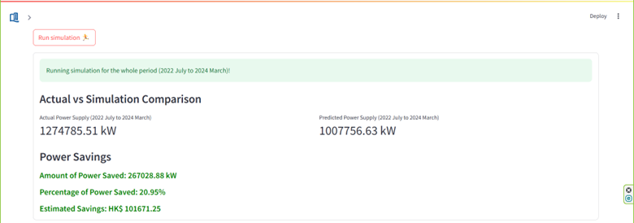
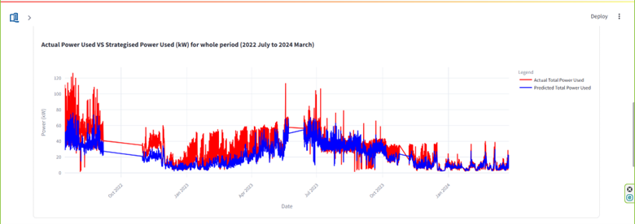
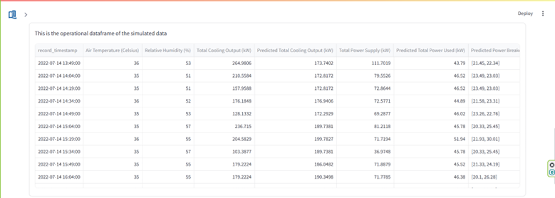
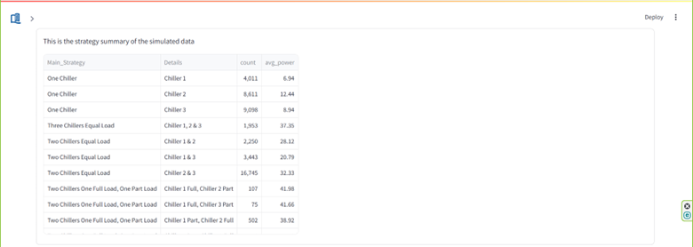
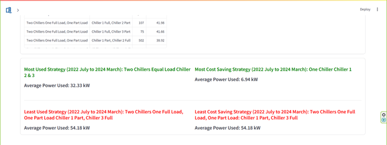

---

## Repository Structure

```
├── App.py                              # Main Streamlit application entry point
├── Explore_Page.py                     # Explore page — data visualisation and analysis
├── Predict_Page.py                     # Predict page — ML predictions and strategy optimisation
├── Simulation.py                       # Simulation page — actual vs. optimised comparison
├── Get_Data.py                         # Data loading and API integration functions
│
├── Chiller_1_data.parquet              # Operational data for Chiller 1
├── Chiller_2_data.parquet              # Operational data for Chiller 2
├── Chiller_3_data.parquet              # Operational data for Chiller 3
├── Predicted_Total_Cooling_Output.parquet   # Pre-computed cooling load predictions
├── Simulated_Optimized_Chiller.parquet      # Pre-computed optimised chiller sequences
├── Temperature_Humidity.parquet        # Historical temperature and humidity data
│
├── cooling_load_model.pkl              # Trained CatBoost model for cooling load prediction
├── cop_chiller_1_model.pkl             # Trained CatBoost model for Chiller 1 COP
├── cop_chiller_2_model.pkl             # Trained CatBoost model for Chiller 2 COP
├── cop_chiller_3_model.pkl             # Trained CatBoost model for Chiller 3 COP
│
├── hkbu.png                            # HKBU logo
├── System Setup.pdf                    # System setup documentation
├── requirements.txt                    # Python dependencies
└── README.md
```

---

## Data

The operational data was collected from **three air-cooled electric chillers** at the Tai Lung Veterinary Laboratory, covering the period from **July 2022 to March 2024** at 10-minute intervals.

### Key Features

| Feature | Description |
|---|---|
| `COP_Own` | Coefficient of Performance of each chiller |
| `Power Supply (kW)` | Electrical power consumed by the chiller |
| `Current Cooling Output (kW)` | Cooling energy produced by the chiller |
| `Water Flow Data (L/s)` | Chilled water flow rate |
| `Return Water Temp` | Temperature of water returning to the chiller |
| `Supply Water Temp` | Temperature of chilled water supplied |
| `Percentage of Loading (%)` | Chiller loading percentage |
| `Air Temperature (Celsius)` | Outdoor air temperature |
| `Relative Humidity (%)` | Outdoor relative humidity |
| `Chiller_X_Status` | On/off status of each chiller (1/0) |

### External Data

Real-time and forecast weather data is retrieved from the [OpenWeatherMap API](https://openweathermap.org/api) for the Tai Lung coordinates (22.48°N, 114.12°E).

---

## Models

All models use **CatBoost** for gradient boosting regression. Pre-trained models are stored as `.pkl` files.

### Cooling Load Model

Predicts the total cooling load (kW) needed based on environmental and temporal features.

| Feature | Type |
|---|---|
| Air Temperature (Celsius) | Environmental |
| Relative Humidity (%) | Environmental |
| Hour, Day of Week, Quarter, Month, Day of Year | Temporal |

### COP Models (one per chiller)

Predicts the Coefficient of Performance for each chiller individually.

| Feature | Type |
|---|---|
| Air Temperature (Celsius) | Environmental |
| Relative Humidity (%) | Environmental |
| Percentage of Loading (%) | Operational |
| Hour, Day of Week, Quarter, Month, Day of Year | Temporal |

The prediction pipeline:
1. Predict the total cooling load from weather + time features
2. Evaluate all chiller combinations and loading distributions
3. Predict COP for each chiller at each loading level
4. Select the strategy that minimises total power consumption

---

## Getting Started

### Prerequisites

- Python 3.10 or higher
- An [OpenWeatherMap API key](https://openweathermap.org/api) (required for the Predict page)

### Installation

```bash
# Clone the repository
git clone https://github.com/EOngjk/Chiller-Efficiency-Prediction.git
cd Chiller-Efficiency-Prediction

# Install dependencies
pip install -r requirements.txt
```

### API Key Setup

Replace the `API_key` variable in `Get_Data.py` with your own OpenWeatherMap API key:

```python
API_key = "your_api_key_here"
```

---

## Usage

```bash
streamlit run App.py
```

The dashboard will open in your browser at `http://localhost:8501`. Use the sidebar to navigate between the Explore, Predict, and Simulation pages.

---

## Known Issues

- The **Predict page.py** requires a valid OpenWeatherMap API key. If the key has expired, the page will display an error. Replace the key in `Get_Data.py` to resolve this.

---

## References

- Ho, K. K. W., & Yu, F. W. (2021). [Review of the advances in air-cooled chillers](https://www.sciencedirect.com/science/article/pii/S036054422032483X). *Energy*, 214.
- Yu, F. W., Ho, W. T., Chan, K. T., & Sit, R. K. Y. (2017). [Evaluation of energy performance of chiller system](https://www.sciencedirect.com/science/article/abs/pii/S0378778816309860). *Energy and Buildings*, 145.
- [Hong Kong Observatory — Climate of Hong Kong](https://www.hko.gov.hk/en/cis/climateHK.htm)

---

## Author

**Eric ONG Jun Kye**
BSc (Hons) Business Computing and Data Analytics, Hong Kong Baptist University (Class of 2025)

Supervised by: Prof. TAI, Samson Kin Hon

---

## Links

- [FYP Poster & Demonstration](https://fyp.comp.hkbu.edu.hk/bcda/poster/2024/poster_internal.php?id=785)
